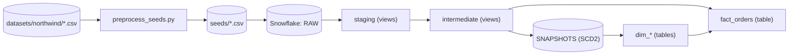

# Modelo dimensional Northwind

Repositorio de referencia para el **Proyecto #4 — Construyendo un Data Warehouse**: modelo dimensional sobre Northwind con **dbt** y **Snowflake**.

## Tabla de contenidos

- [Propuesta de proyecto](#propuesta-de-proyecto)
  - [Objetivos de aprendizaje](#objetivos-de-aprendizaje)
  - [Descripción del proyecto](#descripción-del-proyecto)
  - [Resultado esperado](#resultado-esperado)
  - [Instrucciones](#instrucciones)
  - [Capa opcional](#capa-opcional)
  - [Recursos](#recursos)
- [Guía de la solución](#guía-de-la-solución)
  - [Qué incluye esta implementación](#qué-incluye-esta-implementación)
  - [Requisitos previos](#requisitos-previos)
  - [Permisos Snowflake necesarios](#permisos-snowflake-necesarios)
  - [Reproducir en 5 pasos](#reproducir-en-5-pasos)
  - [Opciones de autenticación](#opciones-de-autenticación)
  - [Modelo de datos](#modelo-de-datos)
  - [Pruebas y checklist de reproducibilidad](#pruebas-y-checklist-de-reproducibilidad)
- [Atribución de datos](#atribución-de-datos)
- [Licencia](#licencia)

---

## Propuesta de proyecto

### Proyecto #4 — Construyendo un Data Warehouse

En este proyecto tendrás la oportunidad de construir un **modelo dimensional** utilizando **Snowflake** y **dbt**.

### Objetivos de aprendizaje

Al finalizar este proyecto habrás aprendido a:

- Crear un modelo dimensional a partir de un modelo relacional
- Materializar modelos de dbt en Snowflake
- Organizar los datos de forma modular, siguiendo la estructura modular propuesta por dbt

### Descripción del proyecto

Trabajarás con el dataset **Northwind**. Los CSV crudos están incluidos en este repositorio bajo `datasets/northwind/` (misma fuente que el enlace del curso).

> **Nota:** Algunos archivos contienen columnas que son imágenes serializadas como texto y contienen caracteres no estándar. Esas columnas **no son necesarias** para el ejercicio de modelado y pueden removerse de los datasets. En esta solución, el script `scripts/preprocess_seeds.py` limpia y excluye columnas problemáticas (por ejemplo `Photo` en empleados) antes de cargar los seeds.

### Resultado esperado

La solución final debe:

1. Crear un **modelo dimensional** que permita modelar de manera analítica el dataset
2. Incluir **al menos 2 tablas de hechos**
3. Estar construida utilizando **dbt**

### Instrucciones

#### 1. Selecciona una plataforma de Data Warehousing

Se recomienda **Snowflake**. Es ampliamente usada en la industria y el proyecto se puede ejecutar con su versión gratuita: [crear cuenta Snowflake](https://signup.snowflake.com/).

> El objetivo principal es practicar **modelado dimensional**; la herramienta es el medio para lograrlo.

#### 2. Ingesta de datos

- Descarga los CSV del dataset Northwind (o usa los de `datasets/northwind/` en este repo).
- Carga el dataset en tu plataforma elegida (Snowflake, PostgreSQL, DuckDB, etc.). Se recomienda usar **seeds en dbt**.

#### 3. Instala dbt y conéctalo con tu Data Warehouse

Instala dbt de manera local (librería de Python) y conéctalo con Snowflake.

Guía de referencia: [Easy guide to create your local dbt + Snowflake playground](https://medium.com/@sara.almedac/easy-guide-to-create-your-local-dbt-snowflake-playground-with-python-generated-data-sources-bc81f31c103c)

#### 4. Modelado de datos

**Lectura recomendada:** [Master Dimensional Modeling](https://www.kimballgroup.com/data-warehouse-business-intelligence-resources/books/data-warehouse-dw-toolkit/)

Para los modelos de dbt, sigue el enfoque por capas (raw → staging → marts). Lecturas sugeridas:

- [Data modeling techniques for more modularity](https://docs.getdbt.com/best-practices/how-we-structure/1-guide-overview)
- [Intro to Data Build Tool (dbt) — Create your first project!](https://courses.getdbt.com/courses/fundamentals)

**a) Zona raw**

- Crea una tabla `raw_TABLE_NAME` por cada CSV.
- Representa el CSV tal cual viene, **sin transformaciones de negocio**.

**b) Zona stg**

- Crea `stg_TABLE_NAME` a partir de las tablas raw.
- Aplica transformaciones ligeras: renombrar columnas, estandarizar formatos, columnas derivadas, `CASE WHEN` para limpiar valores.

**c) Zona marts**

- A partir de staging, construye el modelo dimensional.
- Crea dimensiones (`dim_`) y hechos (`fct_` o `fact_`).
- Ejemplos: `dim_customer`, `dim_product`, `fct_sales`.
- El modelo debe responder preguntas de negocio con datos desnormalizados.

#### 5. Calidad de datos

**Lectura recomendada:** [Building a data quality framework with dbt](https://docs.getdbt.com/best-practices/how-we-build-our-metrics/semantic-layer-1-build-overview)

Crea **al menos 3 pruebas** de calidad con dbt. Ideas:

- Validar que no existan nulos en campos clave (Order ID, Customer ID)
- Fechas dentro de un rango válido
- Valores numéricos (ventas, cantidad) no negativos

### Capa opcional

Crear 2 bases en Snowflake (producción y desarrollo) y un pipeline CI/CD con GitHub Actions que despliegue el código a Snowflake y mueva datos según variables de entorno en el proyecto dbt.

### Recursos

**Técnicos**

- *The Data Warehouse Toolkit* (Kimball) — al menos los primeros 4 capítulos
- [Intro to Data Build Tool (dbt)](https://courses.getdbt.com/courses/fundamentals)

**Recomendados**

- What is a Data Warehouse: Basic Architecture
- Building a Data Warehouse: Basic Architectural principles
- Data Warehouse Pipeline: Basic Concepts & Roadmap
- A Data Warehouse Implementation on AWS
- Data modeling techniques for modern data warehouses
- Data modeling techniques for more modularity
- The 5 essential data quality checks in analytics

---

## Guía de la solución

Esta sección describe **cómo reproducir y ejecutar** la implementación de referencia de este repositorio.

### Qué incluye esta implementación

| Requisito del enunciado | En este repo |
|-------------------------|--------------|
| Modelo dimensional analítico | Sí — capas `RAW → STAGING → INT → SNAPSHOTS → MARTS` |
| Al menos 2 tablas de hechos | **Parcial** — `fact_orders` (pedidos). Extensión natural: `fact_order_details` a grano línea |
| Construido con dbt | Sí |
| Zona raw / stg / marts | Sí — seeds en `RAW`, vistas `stg_*`, tablas `dim_*` y `fact_orders` en `MARTS` |
| Calidad de datos (≥ 3 pruebas) | Sí — tests en `schema.yml` + tests singulares en `tests/` |

**Objetos principales:** dimensiones SCD2 (`dim_customer`, `dim_employee`, `dim_shipper`), `dim_date`, hecho `fact_orders` (una fila por pedido).

> Cualquier persona que clone este repo debe poder ejecutar el proyecto con **su propia** cuenta de Snowflake. No hay credenciales compartidas en el repositorio.

### Requisitos previos

- Cuenta de [Snowflake](https://signup.snowflake.com/) (trial válido)
- **Python 3.12** y `git`
- `bash` (macOS/Linux; en Windows usar WSL)
- Rol con al menos: `USAGE` en warehouse, `USAGE` y `CREATE SCHEMA` en la base de datos, `USAGE` en el rol

### Permisos Snowflake necesarios

```sql
-- Ejemplo (ajusta nombres según tu .env)
USE ROLE <tu-rol>;
USE WAREHOUSE <tu-warehouse>;
CREATE DATABASE IF NOT EXISTS NORTHWIND_DIMENSIONAL_DEV;
```

En cuentas trial con rol amplio suele bastar con crear la base y ejecutar dbt.

### Reproducir en 5 pasos

#### 1. Clonar e instalar Python 3.12

```bash
git clone <url-de-este-repo>
cd modelo-dimensional-northwind
python3.12 -m venv .venv && source .venv/bin/activate
pip install -r requirements.txt
```

#### 2. Configurar credenciales

```bash
cp .env.example .env
# Edita .env con TU cuenta, usuario, rol, warehouse y database.
```

Elige **una** forma de autenticación (ver también [Opciones de autenticación](#opciones-de-autenticación)):

- **Contraseña (recomendado si tienes usuario/contraseña nativos):** añade `SNOWFLAKE_PASSWORD=<tu-contraseña>` en `.env` y usa los comandos del paso 5 **sin** `--target`.
- **OAuth en el navegador (SSO):** no hace falta `SNOWFLAKE_PASSWORD`; en el paso 5 usa `--target dev` en todos los comandos `dbt.sh`.

#### 3. Crear la base de datos en Snowflake

```sql
CREATE DATABASE IF NOT EXISTS NORTHWIND_DIMENSIONAL_DEV;
-- O el nombre que configuraste en SNOWFLAKE_DATABASE
```

#### 4. Preprocesar y verificar los CSV crudos

```bash
python scripts/preprocess_seeds.py
python scripts/verify_seeds.py
```

`verify_seeds.py` debe imprimir `OK: 7/7 seeds match manifest` y salir con código 0.

#### 5. Construir y probar el proyecto

**Opción A — contraseña** (requiere `SNOWFLAKE_PASSWORD` en `.env`):

```bash
./scripts/dbt.sh debug
./scripts/dbt.sh build
```

**Opción B — OAuth en el navegador** (si no usas contraseña o ves `251006: Password is empty`):

```bash
./scripts/dbt.sh debug --target dev
./scripts/dbt.sh build --target dev
```

`dbt build` carga seeds, ejecuta snapshots, materializa modelos y corre tests en orden de dependencias. Con conexión correcta deberías ver algo como **54 PASS** (16 modelos, 7 seeds, 3 snapshots, 28 tests).

### Opciones de autenticación

| Target | Comandos del paso 5 | Requiere |
|--------|---------------------|----------|
| `dev_password` (por defecto en `profiles.yml`) | `./scripts/dbt.sh debug` y `build` | `SNOWFLAKE_PASSWORD` en `.env` |
| `dev` | `./scripts/dbt.sh debug --target dev` y `build --target dev` | Cuenta con SSO; se abre el navegador la primera vez |

El script `./scripts/dbt.sh` carga `dbt_snowflake_oauth_patch.py` (útil para OAuth; no afecta el flujo con contraseña).

> **Probado en clone limpio:** pasos 1–4 sin Snowflake; paso 5 con `--target dev` completa el build y deja `FACT_ORDERS` = `STG_ORDERS` = 830 en `NORTHWIND_DIMENSIONAL_DEV`.

### Modelo de datos



Capas en Snowflake: `RAW` (seeds) → `STAGING` → `INT` → `SNAPSHOTS` (SCD2) → `MARTS` (`dim_*`, `fact_orders`).

### Pruebas y checklist de reproducibilidad

Tras un clone limpio, puedes validar:

- [ ] `./scripts/dbt.sh debug` → "All checks passed!"
- [ ] `python scripts/verify_seeds.py` → `OK: 7/7 seeds match manifest`
- [ ] `./scripts/dbt.sh build` → **16** modelos, **28** tests de datos, 0 errores (conexión y permisos correctos)
- [ ] `SELECT COUNT(*) FROM MARTS.FACT_ORDERS` = `SELECT COUNT(*) FROM STAGING.STG_ORDERS` = **830**
- [ ] Esquema `SNAPSHOTS`: `snapshot_customer_history`, `snapshot_employee_history`, `snapshot_shipper_history`

Tests singulares incluidos:

- `assert_stg_orders_count_eq_fact_orders` — misma cardinalidad staging vs hecho
- `assert_fact_orders_scd_dims_temporal_window` — `order_date` dentro de la ventana SCD2 de cada dimensión

---

## Atribución de datos

Northwind es un dataset de ejemplo de Microsoft. Ver [DATA-LICENSE.md](DATA-LICENSE.md).

## Licencia

Código del proyecto: [MIT](LICENSE).
